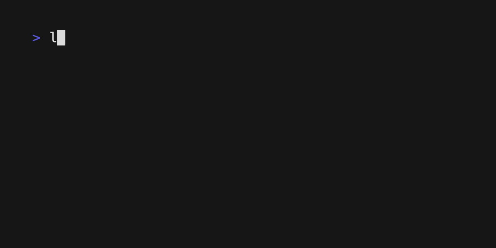
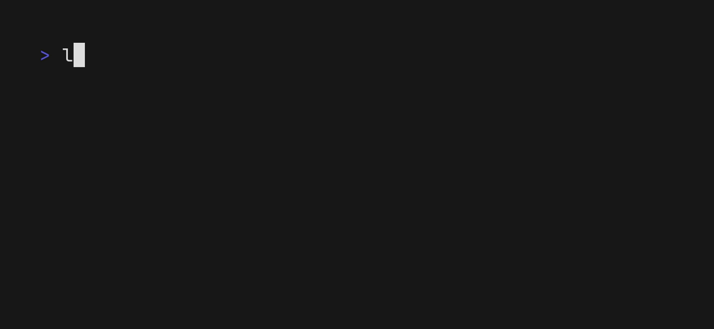
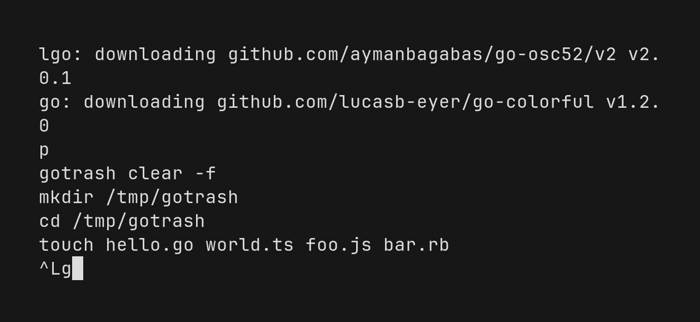

# gotrash

[](https://github.com/koki-develop/gotrash/releases/latest)
[](https://github.com/koki-develop/gotrash/actions/workflows/ci.yml)
[](https://goreportcard.com/report/github.com/koki-develop/gotrash)
[](./LICENSE)

rm alternative written in Go.

- [Installation](#installation)
- [Usage](#usage)
  - [`put`](#gotrash-put)
  - [`list`](#gotrash-list)
  - [`restore`](#gotrash-restore)
  - [`clear`](#gotrash-clear)
- [LICENSE](#license)

## Installation

### Homebrew

```console
$ brew install koki-develop/tap/gotrash
```

### `go install`

```console
$ go install github.com/koki-develop/gotrash@latest
```

### Releases

Download the binary from the [releases page](https://github.com/koki-develop/gotrash/releases/latest).

## Usage

```console
$ gotrash --help
rm alternative written in Go.

Usage:
  gotrash [command]

Available Commands:
  clear       Clear all trashed files or directories
  completion  Generate the autocompletion script for the specified shell
  help        Help about any command
  list        List trashed files or directories
  put         Trash files or directories
  restore     Restore trashed files or directories

Flags:
  -h, --help      help for gotrash
  -v, --version   version for gotrash

Use "gotrash [command] --help" for more information about a command.
```

### `gotrash put`

`gotrash put` trashes files or directories.


Files and directories trashed by `gotrash put` are not deleted, but placed in the trash can ( `$GOTRASH_ROOT/can` ) .  
The `$GOTRASH_ROOT` environment variable ( default: `$HOME/.gotrash` ) can be rewritten to customize the trash can path.

### `gotrash list`

Alias: `gotrash ls`

Files and directories in the trash can can be viewed with `gotrash list`.

```console
$ gotrash list
```


### `gotrash restore`

Alias: `gotrash rs`

Trashed files and directories can be restored with `gotrash restore`.  
Check the index with `gotrash list` and pass it.



If you execute without specifying indexes, fuzzy finder will start.  
You can use the tab key to select multiple files or directories to restore.



### `gotrash clear`

`gotrash clear` deletes all trashed files and directories.



## LICENSE

[MIT](./LICENSE)
